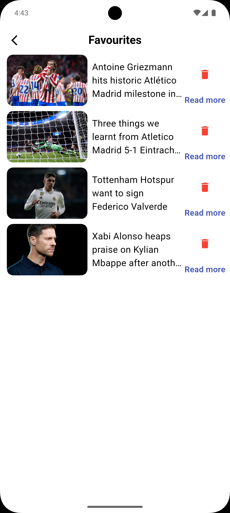
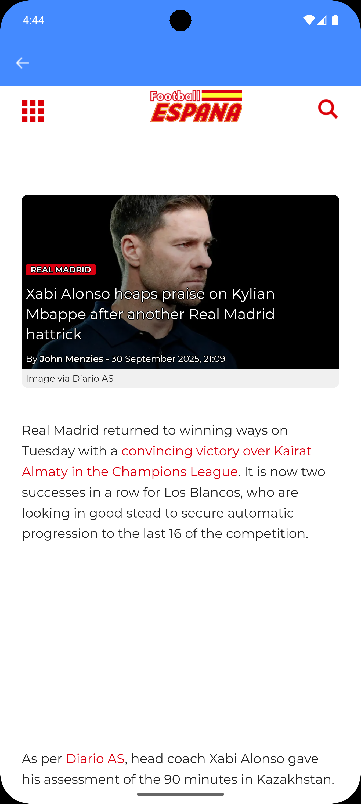

# ⚽ Football News App

A modern **Football News mobile application** built with **Flutter**, following **Clean Architecture** principles.  
The app delivers the latest football news with secure authentication, multi-language support, and a clean UI.

---

## ✨ Features

- 🌐 **REST API integration** for fetching the latest football news
- 🔐 **Firebase Authentication** for user login & signup
- 🌍 **Multi-language support** with Easy Localization
- 🌙 **Dark/Light mode** with Shared Preferences
- ⭐ **Favourites** powered by Hive DB
- 🌐 **In-app browsing** using WebView
- 🏗️ **Clean Architecture** applied for scalability and maintainability

---

## 🛠️ Technologies

- **Flutter** (Dart)
- **Riverpod** (State Management)
- **REST API**
- **Firebase Authentication**
- **Hive DB** (local database)
- **Shared Preferences** (theme persistence)
- **Easy Localization** (multi-language)
- **WebView**
- **Clean Architecture**

---

## 📸 Screenshots

| Home Page                               | Favourites                                       | WebView                                   |
|-----------------------------------------|--------------------------------------------------|-------------------------------------------|
|     |  |  |

---

## 🚀 Getting Started

1. **Clone the repository**
   ```bash
   git clone https://github.com/Jamshid-Mominjonov/football_news_app.git

2. **Install dependencies**
    ```bash
    flutter pub get
    ```

3. **Run the app**
    ```bash
    flutter run
    ```

## 📄 License

This project is licensed under the **MIT License** – see the [LICENSE](LICENSE) file for details.

---

## 👨‍💻 Author

**Jamshid Mo'minjonov**  
📧 [jamshidmominjonov05@gmail.com](mailto:jamshidmominjonov05@gmail.com)

---

## 🔗 Connect with me

- [LinkedIn](https://www.linkedin.com/in/Jamshid-mominjonov-55ba19294)
- [GitHub](https://github.com/Jamshid-Mominjonov)